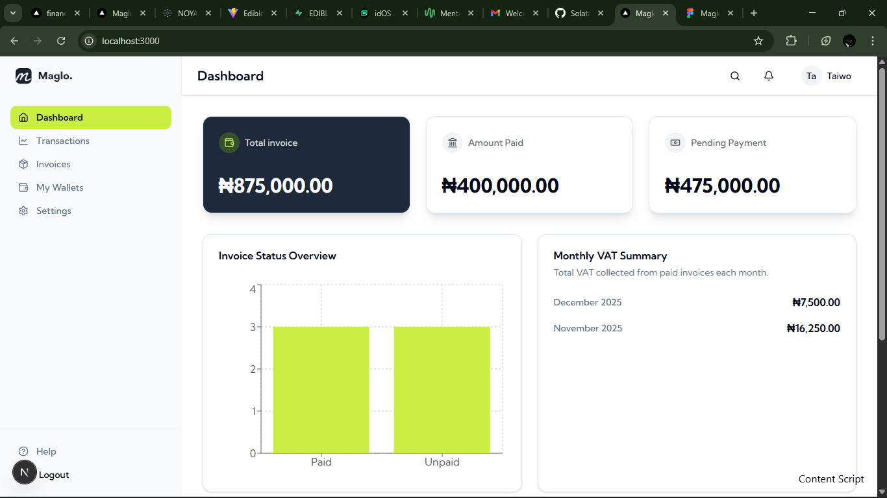

# FinDash - Finance Management Dashboard

A responsive and user-friendly finance management dashboard for small businesses, designed to simplify invoice management and provide clear financial summaries. Built with a modern tech stack focused on performance and type safety.

### 🔗 Live Demo: [HERE](https://finance-dashboard-swart-ten.vercel.app/)

### 🎥 Demo Video: [HERE](https://www.loom.com/share/f45d66f98e2f4d64aff76678e0ca6fed)



---

## ✨ Key Features

- **Secure Authentication:** Full user registration and login system powered by Appwrite Auth. Protected routes ensure only authenticated users can access the dashboard.
- **Dynamic Dashboard:** An at-a-glance overview of key financial metrics, including Total Revenue, Pending invoices, and VAT summaries, which update in real-time.
- **Full Invoice Management (CRUD):**
  - **Create:** Add new invoices through an intuitive modal form.
  - **Read:** View all invoices in a clean, filterable table.
  - **Update:** Mark invoices as "Paid" and edit existing invoice details.
  - **Delete:** Remove invoices with a confirmation step.
- **Real-Time State Management:** The UI updates instantly when invoices are created, updated, or deleted, thanks to Zustand.
- **Automated VAT Calculation:** Real-time VAT calculation for all line items.
- **Data Visualization:** An interactive bar chart from Recharts provides a clear visual breakdown of paid vs. unpaid invoices.
- **Pixel-Perfect UI:** The user interface is carefully crafted to match the provided Figma design specifications.
- **Fully Responsive:** A seamless experience across all devices, from large desktops to mobile phones, featuring a slide-out navigation menu for smaller screens.
- **Advanced Polish:** Includes user-friendly features like toast notifications, form validation, and dynamic due-date countdowns (e.g., "Overdue", "Due in 5 days").

---

## 🛠️ Tech Stack

- **Frontend:** Next.js(SSR), React, TypeScript
- **Backend-as-a-Service (BaaS):** Appwrite (for Authentication and Database)
- **Styling:** Tailwind CSS
- **UI Components:** ShadCN/UI
- **State Management:** Zustand
- **Charting:** Recharts
- **Date Management:** date-fns
- **Deployment:** Vercel (CI/CD)

---

## 🚀 Running the Project Locally

To set up and run this project on your local machine, follow these steps:

1.  **Clone the Repository:**

    ```bash
    git clone https://github.com/Solataiwo-15/finance-dashboard.git
    cd finance-dashboard
    ```

2.  **Install Dependencies:**

    ```bash
    npm install
    ```

3.  **Set Up Environment Variables:**
    - Create a file named `.env.local` in the root of the project.
    - Add your Appwrite project credentials. You can get these from your Appwrite Cloud console.

    ```env
    NEXT_PUBLIC_APPWRITE_PROJECT_ID="YOUR_PROJECT_ID"
    NEXT_PUBLIC_APPWRITE_ENDPOINT="https://cloud.appwrite.io/v1"
    NEXT_PUBLIC_APPWRITE_DATABASE_ID="YOUR_DATABASE_ID"
    NEXT_PUBLIC_APPWRITE_INVOICES_COLLECTION_ID="YOUR_COLLECTION_ID"
    ```

4.  **Run the Development Server:**

    ```bash
    npm run dev
    ```

    The application will be available at `http://localhost:3000`.
